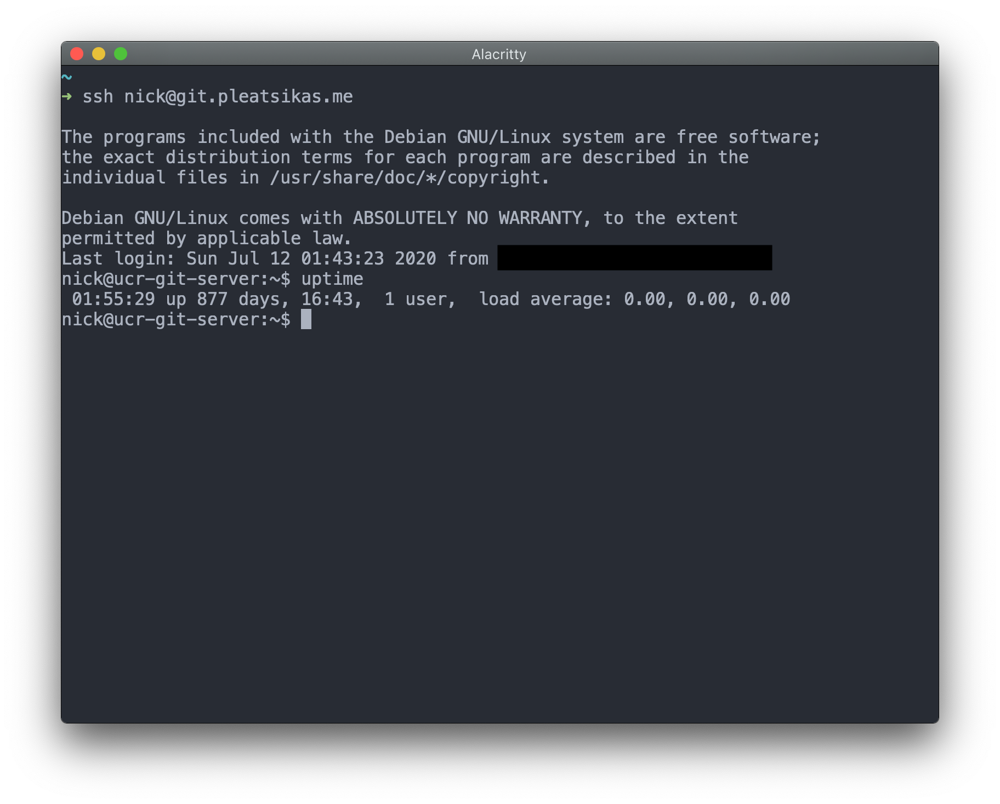

# gogs-migration
Migration tools and some statistics from my personal Gogs instance I ran in 
university.

## Contents
- [`/bin`](/bin): Folder with various scripts I used to migrate my repositories 
  from Gogs. Includes extra tools to gather statistics from the service.
  - [`/bin/download-repos`](/bin/download-repos): Downloads repositories from 
    Gogs using the repo api that match a supplied regex. For example, I used 
    `ucr-(cs|ee)[0-9]{2,3}[A-z]?` to match all repositories from university.
  - [`/bin/extract-commits.py`](/bin/extract-commits.py): Extracts commit 
    information from one or more repositories and saves them to a CSV.
  - [`/bin/rewrite-remotes`](/bin/rewrite-remotes): Change Git remotes
    based on a sed-compatible regex for all repositories in a given folder.
- [`/docs`](/docs): Documentation including screenshots.
- [`/playbooks`](/playbooks): Ansible playbooks used to setup environment
  where git repositories will live.
  - [`/playbooks/setup-git.yml`](/playbooks/setup-git.yml): Create requisite 
    user, volume, and repositories on Synology NAS. To get a list of 
    repositories to use this playbook, run the following command:

```bash
$ ls -l /path/to/repos | rev | cut -d " " -f1 | rev > repositories.txt
$ # Now run the playbook.
$ ansible-playbook setup-git.yml -k -K -e "ssh_key=id_rsa.pub"
```

- [`/activity.ipynb`](/activity.ipynb): Notebook containing commit graphs
  generated from the CSV created by `/bin/extract-commits.py`.

## Other Bits
- I made 930 commits across 16 repositories in the 4 years I attended university
  (this isn't a comprehensive list as there are some repositories on other 
  services with more commits, but this is a good approximation).
- The host Gogs was running on had not been rebooted in 877 days when I finally 
  turned it off. Oops.
